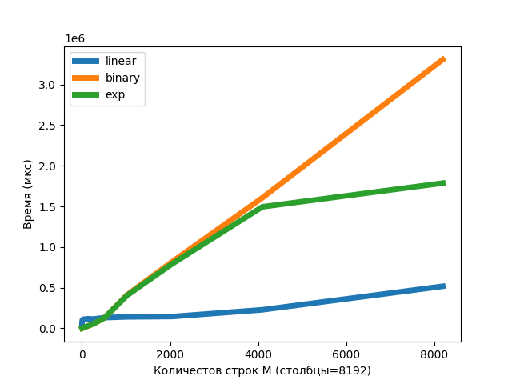
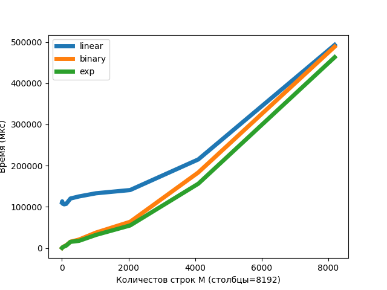
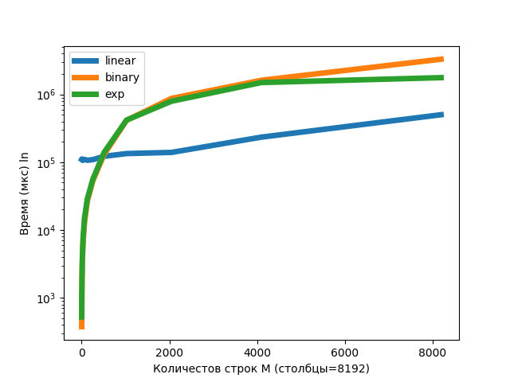
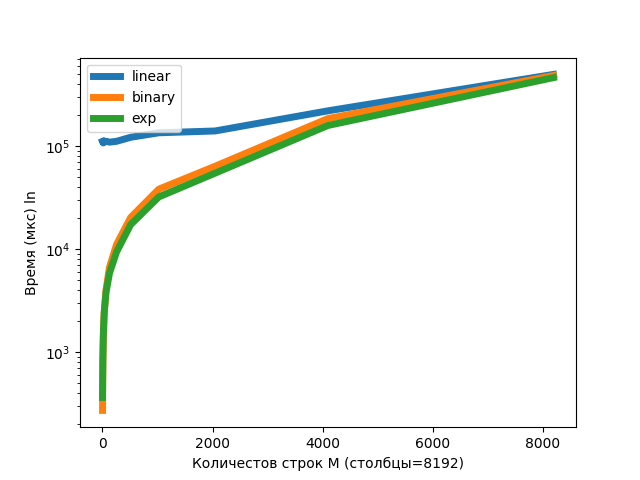

# Лабораторная работа по алгоритмам #1

## Три реализации алгоритма для поиска таргет элемента:

### Линейный:

    def linear_search(matrix: List[List[int]], target_number: int):
        row_index = 0
        column_index = len(matrix[0]) - 1
    
        while row_index < len(matrix) and column_index >= 0:
            if matrix[row_index][column_index] == target_number:
                return True
            if matrix[row_index][column_index] > target_number:
                column_index -= 1
            elif matrix[row_index][column_index] < target_number:
                row_index += 1
        return False

_Асимптотика_: O(N+M)

### Бинарный

    def get_new_column_position(row: List[int], left: int, right: int, target: int):
        while right > left + 1:
            mid = (right + left) // 2
            if row[mid] == target:
                return mid
            elif row[mid] > target:
                right = mid
            elif row[mid] < target:
                left = mid
        return right - 1

    def bin_search(matrix: List[List[int]], target_number: int):
        row_index = 0
        column_index = len(matrix[0]) - 1

        while row_index < len(matrix) and column_index >= 0:
            if matrix[row_index][column_index] == target_number:
                return True
            elif matrix[row_index][column_index] < target_number:
                row_index += 1
            elif matrix[row_index][column_index] > target_number:
                column_index = get_new_column_position(matrix[row_index], 0, column_index, target_number)
        return False

_Асимптотика_: O(M*log(N))

### Экспоненциальный (Внутри запускается бинраный)

    def find_new_column_position(row: List[int], left: int, right: int, target: int):
        while right - left > 1:
            mid = (right + left) // 2
            if row[mid] > target:
                right = mid
            else:
                left = mid
    
        return right - 1

    def get_exp_bound(matrix, row_index, column_index: int, target: int):
        if column_index > 16:
            exp = 2
            while column_index >= exp and matrix[row_index][column_index - exp] > target:
                exp <<= 1
            exp >>= 1
        else:
            exp = 0
    
        return exp

    def exp_search(matrix: List[List[int]], target: int):
        row_index = 0
        column_index = len(matrix[0]) - 1
    
        while row_index < len(matrix) and column_index > -1:
            if matrix[row_index][column_index] == target:
                return True
            elif matrix[row_index][column_index] < target:
                row_index += 1
            else:
                exp = get_exp_bound(matrix, row_index, column_index, target)
    
                column_index = find_new_column_position(matrix[row_index],
                                                        -1,
                                                        column_index - exp,
                                                        target)
        return False

_Асимптотика_: O(M*log(N))

## Генерации тестовых данных:

### (N//M * i + j) * 2 (target = 2*N + 1)

    def first_matrix_generator(rows_number: int, columns_number: int) -> Iterable[List[int]]:
    
        for i in range(1, rows_number+1):
            row = []
            for j in range(1, columns_number+1):
                row.append((columns_number // rows_number * i + j) * 2)
            yield row

### (N//M* i * j) * 2 (target = 12*N + 1)

    def second_generator_matrix(rows_number: int, columns_number: int) -> Iterable[List[int]]:

    for i in range(1, rows_number+1):
        row = []
        for j in range(1, columns_number+1):
            row.append((columns_number // rows_number * i * j) * 2)
        yield row

### Замеры выполнения:

Для замеров использовался модуль timeit
Замеры можно посмотреть в файлике `results.txt`

### Графики

Графики строилсь с помощью `matplotlib`

### Замеры на первом генераторе:

### Замеры на втором генераторе

### Вот еще логарифмические графики:
#### Первый генератор:

#### Второй генератор:

### Вывод

- В первой генерации данных линейный алгоритм работает быстрее, чем два других алгоритма.
  это достигается за счет меньшей константы, то есть линейны имеет асимптотику N+M и
  поэтому в наших данных с увеличением строк время вырастает примерно линейно, в
  двух других алгоритмах же имеем M*log(N), то есть с увеличением количества строк
  идет очень большой рост времени выполнения, по сути они в log(n) раза медленнее
  линейного алгоритма в данном случае.
- Так же в первой генерации отличительным является резкое ускорение экспоненциального поиска.
  Это связано с тем, что сам экспоненциальный поиск заканчивается (в моей реализации после того,
  как индекс столбца стал 16) и после этого у нас идет только бинарный поиск на малых промежутках
  или вообще линейный спуск вниз. Если же не делать ту оптимизацию с <16, то оба алгоритма будут
  иметь примерно одинаковую скорость. Бинарный же продолжает идти, как шел и в итоге с учетом наших
  данных он сдвигается на один влево и при этом делает это за log время.
- Во второй же генерации у нас все выполняется примерно одинаково, но линейный поиск даже со своей меньшей
  константой хуже других алгоритмов. Это связано с плохим таргетом, то есть он будет находится в левом нижнем
  краю (ну ближе к нему), в итоге линейному поиску нужно пройти с правого края до левого и только
  потом спускаться (он это делает за n время очевидно), два других же алгоритма делают это
  за log время, то есть у линейного время получается ~O(N + M), а других ~O(log(N)+M).
  За счет этого линейный поиск работает медленнее
- Так же во второй генерации экспоненциальный поиск работает бы быстрее бинарного по
  то же причине, что в первой генерации.

### Примечание:
Дополнительную информацию о выполнении работы, которая
напрямую к алгоритмам не относится, можно посмотреть
а `INFO.md`